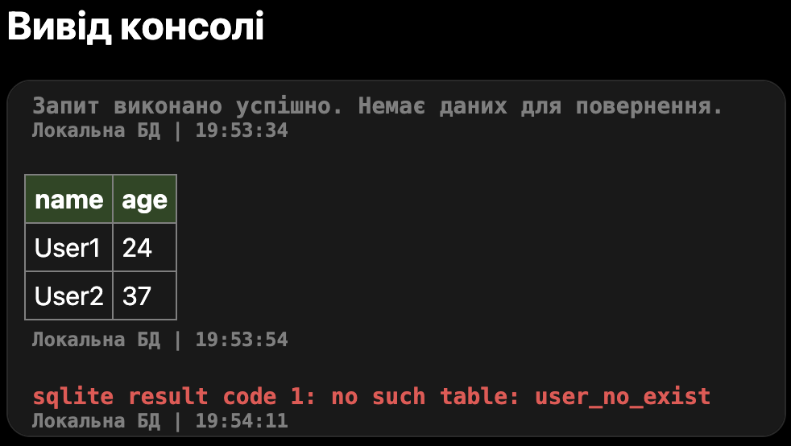

# BravSQL

> **Local-first SQLite editor** — веб-застосунок на базі WASM та OPFS реалізації SQLite для браузера.

[](https://bravsql.pages.dev)

-----

### Language
[English](./README.md) | __Українська__

-----

## Зміст

- [Мотивація](#мотивація)
- [Чому BravSQL](#чому-bravsql)
- [Цільова аудиторія](#цільова-аудиторія)
- [Стек технологій](#стек-технологій)
- [Архітектура та функціональність](#архітектура-та-функціональність)
- [Інтерфейс](#інтерфейс)
- [Локальне розгортання](#локальне-розгортання)
- [Плани](#плани)

-----

## Мотивація

Під час вивчення дисципліни **«Бази Даних і Інформаційні системи»** деякі одногрупники витрачали значний час на встановлення та налаштування SQLite — особливо користувачі Windows.

SQLite — одна з небагатьох СУБД, що працює безпосередньо з файлом без необхідності піднімати сервер. Та навіть вона вимагає базових навичок роботи з командним рядком, прав адміністратора та повноцінного ПК. Користувачі мобільних пристроїв (Android / iOS) не можуть встановити її взагалі.

Існуючі веб-сервіси для роботи з SQLite вирішують проблему кросплатформеності, але породжують нові:

- залежність від стабільного інтернет-з’єднання
- необхідність реєстрації
- відправлення даних на сторонній сервер — ризик конфіденційності
- відсутність збереження даних між сесіями

**BravSQL** усуває всі ці проблеми: СУБД встановлюється програмно під час завантаження сторінки, дані зберігаються локально у файловій системі браузера (OPFS), а інтернет потрібен лише для першого завантаження.

-----

## Чому BravSQL

|Проблема                       |Рішення в BravSQL                                               |
|-------------------------------|----------------------------------------------------------------|
|Складне встановлення SQLite    |Автоматичне завантаження через WASM при відкритті сторінки      |
|Прив’язка до ПК та ОС          |Працює в будь-якому сучасному браузері, включно з мобільними    |
|Дані йдуть на сервер           |Повністю локальне зберігання через OPFS — жодних серверів       |
|Немає збереження між сесіями   |OPFS зберігає базу даних у ізольованій файловій системі браузера|
|Залежність від інтернету       |Після першого завантаження — повна офлайн-робота                |
|Відсутність інтеграції з хмарою|Опціональна підтримка Cloudflare D1 сумісного API               |

-----

## Цільова аудиторія

- **Школярі та студенти** — вивчення SQL без встановлення ПЗ, особливо ті, хто не має власного ПК
- **Розробники** — швидке тестування SQL-запитів на будь-якому пристрої; підключення реальної бази через Cloudflare D1 API; застосунок як захисний шар із зручним інтерфейсом
- **DevOps інженери** — безпечне тестування міграцій перед production завдяки клонуванню таблиць з віддаленої БД до локальної
- **Викладачі** — демонстрація SQL без налаштування середовища для кожного студента; виконання завдань прямо на сайті; не потрібні права адміністратора
- **Звичайні користувачі** — ознайомлення з SQLite без технічних знань

-----

## Стек технологій

HTML, CSS, JavaScript, TypeScript, WASM

Web Workers, OPFS

-----

## Архітектура та функціональність

### Режими роботи

|Режим                 |Опис                                                 |
|----------------------|-----------------------------------------------------|
|Локальний / Глобальний|Перемикання між локальною OPFS-базою та віддаленою БД|
|Safe Mode             |Блокує потенційно небезпечні команди                 |
|Read Only             |Забороняє будь-які зміни в базі даних                |

### Налаштування

- Підключення до віддаленої СУБД через Cloudflare D1 сумісний API
- Клонування частини або всієї таблиці з віддаленої БД до локальної (для безпечних експериментів)
- Налаштування адреси проксі-сервера для обходу CORS (є проксі за замовчуванням)
- Вибір шляху до локальної бази даних SQLite

### Cloudflare D1 сумісний API

Застосунок підтримує підключення до будь-якого бекенду, що повертає відповідь у наступному форматі:

```json
{
  "result": [
    {
      "results": [
        { "id": 1, "name": "User1" },
        { "id": 2, "name": "User2" }
      ]
    }
  ],
  "errors": [],
  "success": true
}
```

> [!NOTE]
> Інтеграція з віддаленою БД є **опціональною** — застосунок повноцінно працює і без неї.

-----

## Інтерфейс

### Особливості

- Адаптивна тема (світла та темна)
- Підсвічування синтаксису SQL у полі введення (highlight.js)
- Автодоповнення на основі попередніх команд
- Колірна диференціація: локальні / віддалені таблиці, службові повідомлення, помилки
- М’які мінімалістичні стилі з анімаціями
- Навігація кнопками та тумблерами

### Демонстрація


- Підсвітка синтаксису під час введення
- Автодоповнення

- Перемикання між локальними базами даних

- Вікно консолі (таблиця, порожній результат, помилка)

- Меню налаштувань (режими, підключення до віддаленої БД, клонування таблиці)

- Модальні вікна та алерти

-----

## Локальне розгортання

Проєкт відкритий для використання та покращень.

> [!WARNING]
> Для локального розгортання необхідний SSL-сертифікат (HTTPS), оскільки деякі функції (зокрема OPFS) недоступні при роботі через HTTP.
> Також рекомендується підключити конфігураційний файл [__`coi-serviceworker.min.js`__](./src-uk/coi-serviceworker.min.js) із кореня проєкту для автоматичного налаштування необхідних браузерних прапорів.

```bash
# Клонувати репозиторій
git clone https://github.com/pryharinbohdan/bravsql.git
cd bravsql/src-uk
# Запустити локальний сервер за допогою Python або інших сервісів
python -m http.server 7420 
```

Або використайте готову інфраструктуру Cloudflare Pages — розгортання одним кліком.

-----

## Плани

*(буде доповнено)*

-----

## Ліцензія

*(буде додано)*

-----

<div align="center">
  <a href="https://bravsql.pages.dev">🚀 Спробувати зараз</a>
</div>