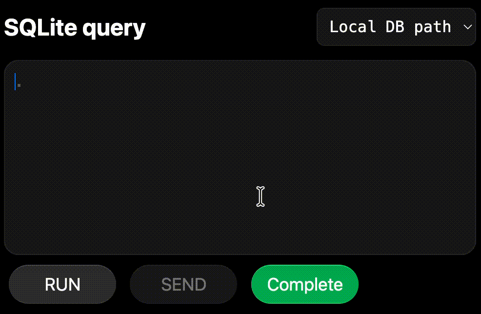
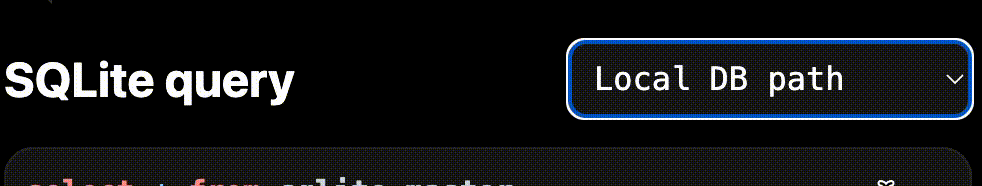
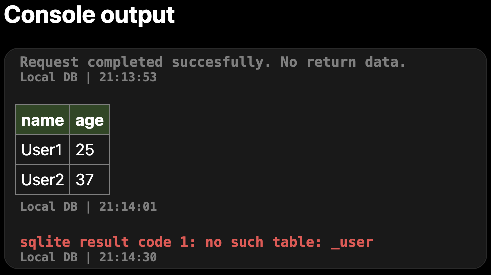
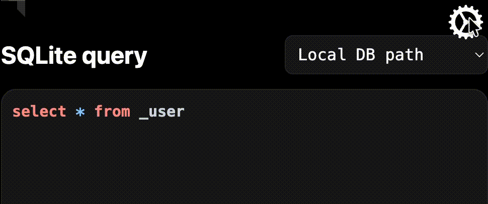
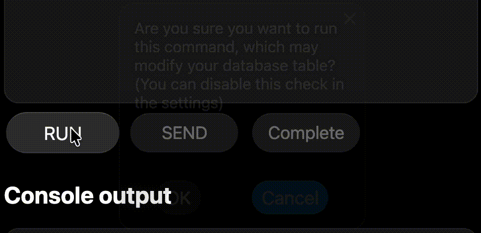

<div align="center">

<h1>BravSQL</h1>
</div>

> **Local-first SQLite editor** — a web application based on WASM and OPFS implementations of SQLite for the browser.

[](https://bravsql.pages.dev)

-----

### Language
__English__ | [Українська](./README-UK.md)

-----

## Table of Contents

- [Motivation](#motivation)
- [Why BravSQL](#why-bravsql)
- [Target Audience](#target-audience)
- [Technology Stack](#technology-stack)
- [Architecture and Functionality](#architecture-and-functionality)
- [Interface](#interface)
- [Local Deployment](#local-deployment)
- [Plans](#plans)

-----

## Motivation

While studying the **"Databases and Information Systems"** course, some classmates spent significant time installing and configuring SQLite — especially Windows users.

SQLite is one of the few DBMSs that works directly with a file without the need to run a server. Yet even it requires basic command-line skills, administrator privileges, and a full-fledged PC. Mobile device users (Android / iOS) cannot install it at all.

Existing web services for working with SQLite solve the cross-platform problem but create new ones:

- dependency on a stable internet connection
- need for registration
- sending data to a third-party server — a privacy risk
- no data persistence between sessions

**BravSQL** eliminates all these problems: the DBMS is installed programmatically during page load, data is stored locally in the browser's file system (OPFS), and the internet is only required for the first load.

-----

## Why BravSQL

| Problem                          | Solution in BravSQL                                                   |
|----------------------------------|-----------------------------------------------------------------------|
| Complex SQLite installation      | Automatic download via WASM when opening the page                     |
| Tied to a PC and OS              | Works in any modern browser, including mobile                         |
| Data sent to a server            | Fully local storage via OPFS — no servers                             |
| No persistence between sessions  | OPFS stores the database in the browser's isolated file system        |
| Internet dependency              | After the first load — full offline operation                         |
| No cloud integration             | Optional Cloudflare D1-compatible API support                         |

-----

## Target Audience

- **School and university students** — learning SQL without installing software, especially those without their own PC
- **Developers** — quick SQL query testing on any device; connecting a real database via Cloudflare D1 API; the app as a protective layer with a convenient interface
- **DevOps engineers** — safe migration testing before production by cloning tables from a remote DB to a local one
- **Teachers** — demonstrating SQL without setting up an environment for each student; completing assignments directly on the site; no administrator privileges required
- **Regular users** — getting familiar with SQLite without technical knowledge

-----

## Technology Stack

HTML, CSS, JavaScript, TypeScript, WASM

Web Workers, OPFS

-----

## Architecture and Functionality

### Operating Modes

| Mode                   | Description                                                   |
|------------------------|---------------------------------------------------------------|
| Local / Global         | Switching between the local OPFS database and a remote DB     |
| Safe Mode              | Blocks potentially dangerous commands                         |
| Read Only              | Prohibits any changes to the database                         |

### Settings

- Connecting to a remote DBMS via Cloudflare D1-compatible API
- Cloning part or all of a table from a remote DB to a local one (for safe experimentation)
- Configuring a proxy server address to bypass CORS (a default proxy is provided)
- Selecting the path to the local SQLite database

### Cloudflare D1-Compatible API

The application supports connecting to any backend that returns a response in the following format:

```json
{
  "result": [
    {
      "results": [
        { "id": 1, "name": "User1" },
        { "id": 2, "name": "User2" }
      ]
    }
  ],
  "errors": [],
  "success": true
}
```

> [!NOTE]
> Remote DB integration is **optional** — the application works fully without it.

-----

## Interface

### Features

- Adaptive theme (light and dark)
- SQL syntax highlighting in the input field (highlight.js)
- Autocomplete based on previous commands
- Color differentiation: local / remote tables, service messages, errors
- Soft minimalist styles with animations
- Navigation with buttons and toggles

### Demo

- 
- Syntax highlighting while typing
- Autocomplete

- Switching between local databases

- Console window

- Settings menu

- Modal windows and alerts

-----

## Local Deployment

The project is open for use and improvements.

> [!WARNING]
> Local deployment requires an SSL certificate (HTTPS), as some features (in particular OPFS) are unavailable when running over HTTP.
> It is also recommended to connect the configuration file [__`coi-serviceworker.min.js`__](./src/coi-serviceworker.min.js) from the project root to automatically configure the required browser flags.

```bash
# Clone the repository
git clone https://github.com/pryharinbohdan/bravsql.git
cd bravsql/src
# Start a local server using Python or other services
python -m http.server 7420
```

Or use the ready-made Cloudflare Pages infrastructure — one-click deployment.

-----

## Plans

*(to be added)*

-----

## License

[MIT](./LICENSE)

-----

<div align="center">
  <h2><a href="https://bravsql.pages.dev">🚀 Try it now</a></h2>
</div>

